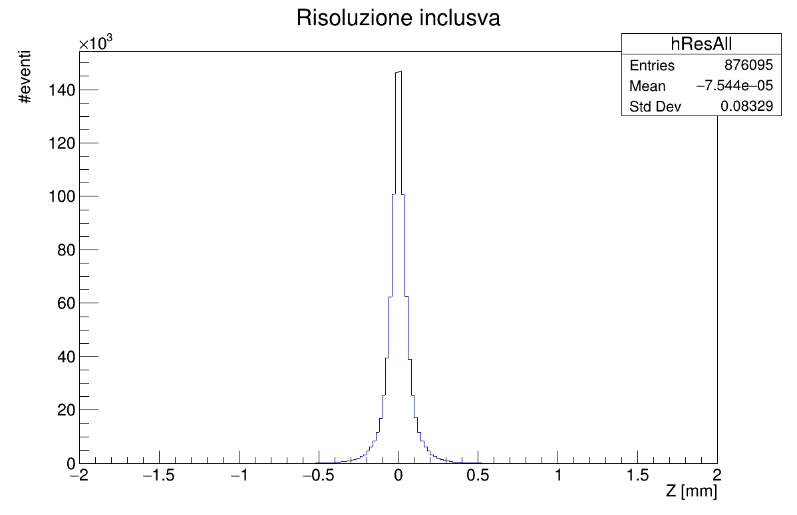
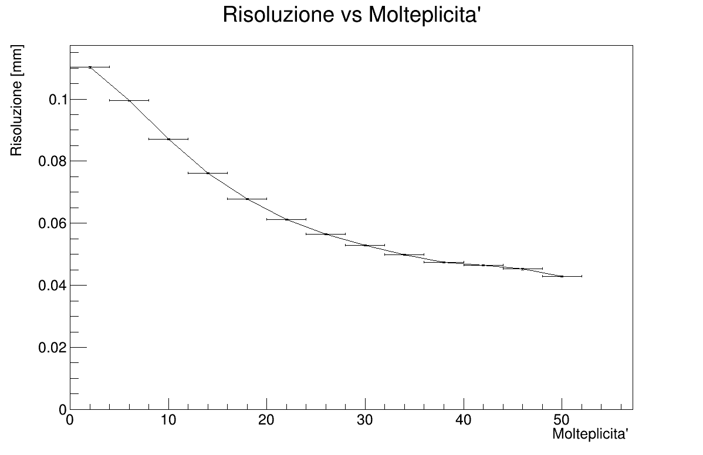
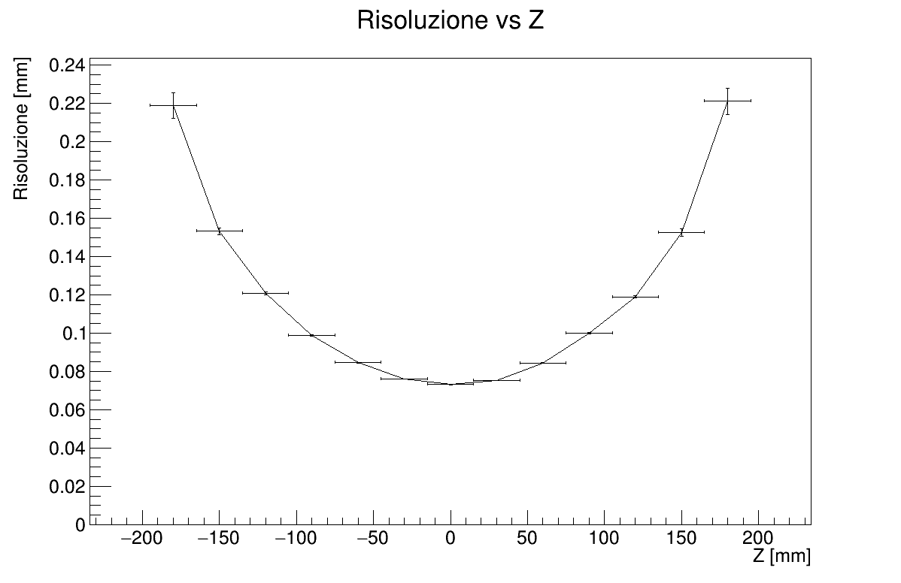
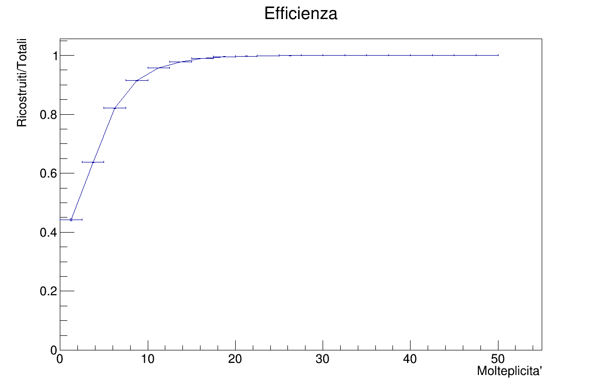
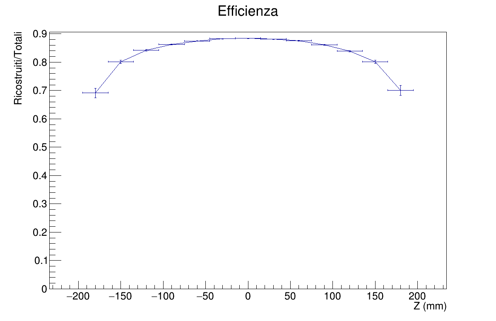

# TANS 2019-2020 Final Project
### Description
This program is a basic implementation of simulation and recontruction of particles colliding events (proton-proton collision).\
The collisions are generated in a region called _collision diamond_ centered in the origin of a cartesian plane, where **z** is the beampipe direction.\
The result of a vertex detector is to determine the coordinates of the collision (_primary vertex_).\
In this project only the *z* coordinate is being reconstructed.

### Experimental Setup
The vertex detector is built of two cylindrical silicon pixel detectors, coaxial with the beampipe.\
While often the interaction region is in a magnetic field, it is supposed that the field intensity and the distance from vertex to detectors is small enough to assume that the trajectories of charged particles are rectilinear (_locally and with high momentum_).\
The vertex specification are:
- The standard deviation in _z_ is .
- The standard deviation in _x_ and _y_ is .

The beampipe is made of Berilium and has a radius of 30 mm and a thickness of 0.8 mm.\
The first pixel detector has a radius of 40 mm and a thickness of 0.2 mm.\
The second pixel detector has a radius of 70 mm and a thickness of 0.2 mm.\
Each one of the detectors 270 mm long.\
Hit points' smearing is based on a gaussian distribution with  in *z* and  in .\
Multiple scattering is simulated in the beampipe and silicon layers.

### Simulation
Collision vertexes are generated with a normal distribution and particles follow the pseudorapidity and angle distribution from a given kinematic file. Multiplicity can be generated from different distributions (_default:_ gaussian).\
The vertex coordinates and multiplicity generate by `generateVertex(double * ptc)` are saved in a double's array `ptc[4]`.\
The coordinates are then passed to the `generateParticles(double *ptc, TClonesArray *particles, const uint8_t distType)` where particles are generated by the defined distributions, then their coordinates are saved in a TClonesArray.\
Particles' array is passed to `intersect(double *ptc, TClonesArray *particles, TClonesArray *Hits, double width, double radius, double z_sm, double rho_sm, int randomNoise)` where intersection with the detector layer is calculated; the method accept as inputs witdh, radius, z smearing, rho smearing and can also generate a number of random coordinates simulating noise and low energy particles.\
Paricles which don't intersect are dropped to speed up computation. The result is a TClonesArray containing hits' coordinates expressed in cylindrical coordinates. The same is repeated for the second detector layer.\
If multiple scattering is enabled, before any intersect, the method `multipleScattering(TClonesArray *particles, double rmsTh)` is called. This method modifies the particles' array by applying the rotation matrix to the scattering vector.\
The simulation then fills a file called `simulation.root` with vertexes' and hits' arrays.

#### Interaction with detector layers
`intersect(double *ptc, TClonesArray *particles, TClonesArray *Hits, double width, double radius, double z_sm, double rho_sm, int randomNoise)` is the intersection method.\
Given a primary vertex and a particles' array, a basic linear interpolation is computed to find the interaction point on the detector. The interaction point is then smeared by generating random values with a given mean and rms value. Detector noise can be generated specifying the number of random points, then the coordinates are generated following a normal distribution for z and .

`multipleScattering(TClonesArray *particles, double rmsTh)` is the multiple scattering method.\
Given a particles' array and a rms angle value, a rotation matrix is built with the particles coordinates then a scattering vector is computed via random generation of  and  values. The two are multiplied and the result are the new particle's coordinates, which replace the originals in the array.

### Reconstruction
The recontruction script reads the events from the previous simulation file to reconstruct events' vertexes. The reconstruction is taking care of *z* coordinate only, since 3D recontruction with this setup is not as precise and the standard deviation on x and y is small enough.
#### Reconstruction procedure
Hits and vertexes are read from the simulation file in a for loop to process every event. The size of the reconstruction can be selected when calling the method.\
Histograms relating hits and multiplicity, hits and Z are filled. Those will be used to compute efficiency.\
The method to reconstruct **z** is then called.
##### Tracklet Algorithm
By reading hits from the arrays, filtering by angle is applied to reduce the following computation.
The remaining hits are then passed to the tracklet class and correlated by `findZVertex()` which uses a simple linear interpolation to return the **z**.\ Reconstructed **z** coordinates are added to a vector and filled in an histogram; then, from the histogram is extracted the mode value by getting the most frequent value via `findMax(TH1I &data, const double &tol)`; a multiple maximum rejection and average is also implemented.\
The mode value extracted is then averaged with the nearest values by the `nearAvg()` method, which selects the values in a neighborhood of a specified width.
The value returned by this method is the definitive reconstructed z.
##### Statistics generation
The reconstruction process will print the resulting statistics, giving the user histograms on:
+ Vertex resolution distribution
+ Resolution vs Z-axis
+ Resolution vs Multiplicity
+ Efficiency vs Z-axis
+ Efficiency vs Multiplicity

To get vertex distribution, the deviation between the generated and the reconstructed coordinate is calculated.\
To get resolution vs Z-axis, a TGraphErrors is built by extracting rms and rms error from the deviation histograms, which have been filled during the reconstruction. The same procedure is applied to the resolution vs multiplicity chart. \
Efficiency charts are instead built by evaluating reconstructed vs generated vertexes, then a TGraphAsymmErrors is drawn.

### Results
Simulation and reconstruction parameters:
+ Multiple scattering enabled with 
+ 0 random noise hits
+ 1'000'000 of events generated and reconstructed
+ Z tolerance of 1 mm
+  tolerance of 0.01 rad

The overall efficiency is of 86.7%.
The resolution is influenced by the multiplicity following an exponential function. In the Resolution vs Z graph is possible to see how the resolution is greatly increased near z=0, while diverging at the ends.\
Regarding the efficiency, with higher multiplicity the algorithm is more efficient as expected. In terms of Z, efficiency is best when near the center with a plateau of 0.9, while degrading at the ends.

Histograms:
+ Total Resolution (distribution of deviation)


+ Resolution vs Multiplicity


+ Resolution vs Z


+ Efficiency (Reconstructed/Total) vs Multiplicity


+ Efficiency (Reconstructed/Total in ) vs Multiplicity


+ Efficiency (Reconstructed/Total) vs Z


### How to run
+ open a terminal
+ run `git clone https://www.github.com/albydnc/tansSim` to clone the project
+ change directory by typing `cd ./tansSim`
+ open `root` in terminal
+ run `.L compile.cxx`
+ run `compile_simulation()`, it takes a while
+ to run the simulation, `simulation(true, 10)` where `true` is enabling multiple scattering and `10` is the number of random noise points per layer
+ when it is complete, to reconstruct run `recontruction("simulation.root",0,1,0.001)`, where arguments are filename, number of events to be processed, tolerance and minimum theta filter

### Simulation and Reconstruction Performance
**Testbench:**
+ Ubuntu 18.04.2 LTS
+ ROOT v6.19.0
+ Intel i7-6700HQ Laptop CPU
+ 16GB DDR4 RAM
+ 512GB NVMe SSD

With default settings, simulation of 1M events takes 30 seconds on average.\
Reconstruction of 1M events takes 10 seconds on average.

Performance is greatly improved by using the C++11 STL data classes over _TClonesArray_.
Simulation of 1M events is around 10 seconds average. **8x faster**.\
As for now (ROOT v6.19.0), _TTree_ does not support `std::vector<std::array<double,2>>` so the development is not further going on.
I will keep track of ROOT new releases to see if it will be supported.\
Post opened on the [ROOT forum](https://root-forum.cern.ch/t/adding-std-array-double-2-to-a-ttree-branch/37425) regarding this issue.

### Project Files Tree
```
project
+--- src
     +--- simulation.C
     +--- reconstruction.C
     +--- simulation_std.C
+--- lib
     +--- collision.h
     +--- collision.cxx
     +--- detector.h
     +--- detector.cxx
     +--- hit.h
     +--- hit.cxx
     +--- particle.h
     +--- particle.cxx
     +--- tracklet.h
     +--- tracklet.cxx
+--- data
     +--- kinem.root
+--- img
+--- tex
+- compile.cxx
+- compile_std.cxx
```
**Libraries Description**:
+ *collision*: generate vertex, multiplicity and direction
```
ImportKinem(): import kinematic file
getDir(): generate particle direction
getCoordinates() get vertex coordinates and multiplicity
generateCollision() generate vertex and multiplicity
```
+ *detector*: intersect with detector layers, random noise and multiple scattering
```
intersect() intersect with detector layer
randomHits() generate random hits
multipleScattering() multiple scattering generator
```
+ *hit*: hit coordinates, angle difference method
```
getTheta() get theta coordinate
getZ() get z coordinate
deltaTheta() difference between theta angles
```
+ *particle*: particle direction, transport layer
```
getTheta()
getPhi()
setTheta()
setPhi()
```
+ *tracklet*: z-vertex finder
```
findZVertex() find z vertex by generating tracklets
```

*Written by Alberto Perro - 2019*
